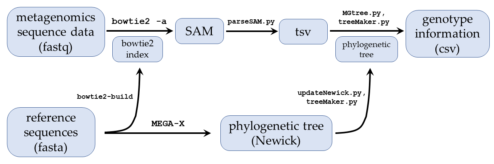

# MGtree: metagenomics analysis using a novel approach via short read alignments and a phylogenetic tree

## Table of Contents
* [Introduction](#intro)
* [Reference sequences](#reference)
  * [Creating a phylogenetic tree](#creating)
  * [`updateNewick.py`](#updatenewick)
  * [Reference indexing](#index)
* [Sample processing](#sample)
  * [Adapter removal](#adapter)
  * [Alignment with `bowtie2`](#align)
  * [`parseSAM.py`](#parsesam)
  * [`MGtree.py`](#mgtree)
* [Accessory scripts](#accessory)
  * [`treeMaker.py`](#treemaker)
  * [`utils.py`](#utils)
  * [`test.sh`](#test)
* [Miscellaneous](#misc)
<br><br>

<a name="intro"></a>
## Introduction

This pipeline performs metagenomics classification of reads against a set of reference sequences via a phylogenetic tree.  It is alignment-based, making it particularly suitable for querying against references that are very similar to each other.

The pipeline produces a list of the reference genotypes and relative abundances that are found in a given sample.  Note that the pipeline, and this manual, always refer to the output classifications as `genotypes`, but the output could be at any of a number of levels (e.g. serotype, species, strain, etc.), depending on the reference sequences that are being queried against.

The `main` branch of the pipeline, described in this README, contains the core scripts and can be used to process a single sample with the aligner of your choice.  The `nextflow` branch enables batch processing of samples, including QC, alignment with `bowtie2`, and classification; to use this branch, run `git checkout nextflow`.

<figure>
  
  <figcaption><strong>MGtree workflow</strong></figcaption>
</figure>
<br><br>

The pipeline suggests utilizing two open-source programs:
* [`MEGA-X`](https://www.megasoftware.net/) v10.0.4: creates a phylogenetic tree
* [`bowtie2`](http://bowtie-bio.sourceforge.net/bowtie2/manual.shtml) v2.3.5.1: aligns the short reads to a set of reference sequences

The rest of the pipeline, `MGtree.py` and the other scripts, are written in python with minimal dependencies.  They should work with either python2 or python3, but [everyone should be using python3 now](https://pythonclock.org/).  The scripts are described below.
<br><br>

<a name="reference"></a>
## Reference sequences

Reference sequences should be collected in a single fasta-formatted file.  They will be used to create a phylogenetic tree, and a reference index against which to align the reads.  These procedures need to be done only once for a given set of reference sequences, even if multiple samples are to be processed against them.
<br>

<a name="creating"></a>
#### Creating a phylogenetic tree

Before running `MGtree.py`, a phylogenetic tree must be created from the reference sequences to be queried. The tree must be exported as a [Newick string](https://en.wikipedia.org/wiki/Newick_format) for use by the rest of the pipeline.
<br>

<a name="updatenewick"></a>
#### `updateNewick.py`

This script reads in a [Newick string](https://en.wikipedia.org/wiki/Newick_format) from an input file and outputs the same.  It gives every unnamed node a unique name (an integer).  It also can (re)assign genotypes to nodes that are listed in an optional input csv file.  The genotype assignment is done based on node names, so this script may need to be run twice for a given tree: once (without `-n <file>`) to name every node, and then (with `-n <file>`) to assign genotypes.

```
usage: updateNewick.py -i <file> -o <file> [-n <file>] [-v] [-h]

Required arguments:
  -i <file>      Input Newick file
  -o <file>      Output Newick file

Optional arguments:
  -n <file>      Input csv file to genotype nodes
  -v, --verbose  Run in verbose mode
  -h, --help     Show help message and exit
```
<br>

```
  -i <file>      Input Newick file
```
* The nodes in the input Newick string may contain names.  The names must be unique.  Names are not allowed to contain the following characters: `;(),:`
* Nodes with names that contain `_` will have genotypes interpreted as the first token before `_`.  Two or more `_` characters are not allowed in node names.
<br><br>

```
  -n <file>      Input csv file to genotype nodes
```
* This file should list, on each line, a node name and the genotype to be assigned to it, comma-separated.  Genotypes are not allowed to contain the following characters: `;(),:_`

<a name="index"></a>
#### Reference indexing

In order to align reads to a set of references, the reference sequences must be indexed.  This pipeline uses the short read aligner `bowtie2`, whose indexes are created by [`bowtie2-build`](http://bowtie-bio.sourceforge.net/bowtie2/manual.shtml#the-bowtie2-build-indexer).


<a name="sample"></a>
## Sample processing

The rest of the pipeline analyzes a single sample and produces a list of the reference genotypes and relative abundances found therein.  It requires the phylogenetic tree and reference index previously created.  The pipeline is designed to analyze a sample that has been sequenced via some type of massively-parallel sequencing, such as Illumina.  The sequencing can be targeted or shotgun, and single-end or paired-end.

<a name="adapter"></a>
#### Adapter removal

For sequence reads derived from short DNA fragments, the 3' ends may contain portions of a sequencing adapter. This adapter contamination may prevent the reads from aligning to the reference sequences and adversely affect the downstream analysis.  Please consult [this remarkably well-written reference](https://github.com/jsh58/ATAC-seq2#adapter-removal) that discusses two programs for removing adapters: [cutadapt](http://cutadapt.readthedocs.io/en/stable/guide.html) and [NGmerge](https://github.com/jsh58/NGmerge).

<a name="align"></a>
#### Alignment with `bowtie2`

As stated above, this pipeline is particularly suited for querying against references that are very similar.  To this end, it works best when *all* valid alignments of a read/fragment are available to be analyzed.  This can be accomplished with our preferred aligner, [`bowtie2`](https://bowtie-bio.sourceforge.net/bowtie2/manual.shtml) in [`-a` mode](https://bowtie-bio.sourceforge.net/bowtie2/manual.shtml#a-mode-search-for-and-report-all-alignments).

After alignment, the resulting [SAM file](https://samtools.github.io/hts-specs/SAMv1.pdf) is expected to be sorted by queryname.  The sorting can be accomplished via [`samtools sort -n`](http://www.htslib.org/doc/samtools.html), although that extra step can be avoided if the SAM file produced directly by `bowtie2` is left unmanipulated (conversion to BAM is fine).

<a name="parsesam"></a>
#### `parseSAM.py`

This script analyzes a SAM file, considering primary alignments of reads/fragments, as well as secondary alignments that are equivalent (or within a specified threshold).  For paired-end sequencing, if the primary alignment is in a properly paired configuration, only secondary alignments that are also properly paired are evaluated.  The script produces a file that lists, for each read/fragment, the alignment type and the reference sequence(s) to which it aligns.

```
usage: parseSAM.py -i <file> -o <file> [-m <int>] [-s <float>] [-S] [-v] [-h]

Required arguments:
  -i <file>      Input SAM file (name-sorted, with header; use '-' for stdin)
  -o <file>      Output tsv file of reads, aln types, and refs

Optional arguments:
  -m <int>       Minimum MAPQ (def. 0)
  -s <float>     Keep sec alns with AS >= bestAS - <float> (def. 0)
  -S             Skip name-sorting requirement
  -v, --verbose  Run in verbose mode
  -h, --help     Show help message and exit
```
<br>

```
  -i <file>      Input SAM file (name-sorted, with header; use '-' for stdin)
```
* As stated, the input SAM file must have a header and be sorted by queryname (so the script can match up primary and secondary alignments for reads/fragments).
* The requirement for strict queryname sorting can be waived with `-S`.
<br><br>

```
  -o <file>      Output tsv file of reads, aln types, and refs
```
* The output is a headerless tsv file that lists, for each read/fragment, the name (QNAME), the alignment type, and the reference sequence(s) to which the read/fragment had a valid alignment
* The alignment type can be any of the following:
  * `PE`: for paired-end sequencing, where both reads aligned in a properly paired configuration; only one record is given for the pair of reads
  * `R1`: for the R1 read of a pair, where the reads did not align in a properly paired configuration
  * `R2`: for the R2 read of a pair, where the reads did not align in a properly paired configuration
  * `SE`: for single-end sequencing
* The third column lists the reference sequences, comma-separated.  Two alternative entries are:
  * `unmapped`: the read/fragment did not have a valid alignment to any reference sequence
  * `lowMAPQ`: the read/fragment had a MAPQ value that was too low (see `-m <int>` below)
* Here is a small section of the output file for three read pairs:
```
NDX551337_RUO:11:HLG2WBGXV:1:11102:16719:4459    PE   GII.17_PP423019.1
NDX551337_RUO:11:HLG2WBGXV:1:11102:14718:14360   R1   unmapped
NDX551337_RUO:11:HLG2WBGXV:1:11102:14718:14360   R2   GII.14_OR536456.1,GII.14_OR536453.1,GII.14_OR536457.1
NDX551337_RUO:11:HLG2WBGXV:1:11103:10045:17536   PE   GII.14_OR536456.1,GII.14_OR536453.1,GII.14_OR536457.1
```
<br>

```
  -m <int>       Minimum MAPQ (def. 0)
```
* Alignments with a MAPQ below the `-m` threshold are reported as `lowMAPQ` in the output.  The default value of 0 means that no alignments will be reported as such.
* A good explanation of mapping quality scores can be found [here](http://bowtie-bio.sourceforge.net/bowtie2/manual.shtml#mapping-quality-higher-more-unique).  Note that the MAPQs reported by `bowtie2` are not meaningful when it is run with `-k` or `-a`.
<br><br>

```
  -s <float>     Keep sec alns with AS >= bestAS - <float> (def. 0)
```
* `parseSAM.py` considers all secondary alignments of multimapping reads/fragments, but, by default, it reports only the alignments whose scores are equal to the best score for the read/fragment.  Setting a value such as `-s 20` causes `parseSAM.py` also to report secondary alignments whose scores are within 20 of the best.  This is equivalent to the [`-s` parameter of Genrich](https://github.com/jsh58/Genrich#sparam).
* The SAM records should have alignment scores under the extra field `AS`.  If not, all alignments are considered equivalent.
* For paired-end sequencing, the alignment score for a fragment's alignment is equal to the sum of the two alignments' individual scores.  Properly paired alignments take precedence over unpaired alignments, regardless of the alignment scores.
<br><br>

<a name="mgtree"></a>
#### `MGtree.py`

This script analyzes a tsv file of alignments and a phylogenetic tree (via a Newick string).  For each read/fragment, it adds counts to the tree at the lowest common ancestor (LCA) node of the set of alignments.  Properly paired alignments are given a weight of two, and unpaired alignments are each counted as one, as are alignments for single-end reads.

Once the alignments are added to the tree, the script interprets the LCA counts for nodes with assigned genotypes.  There are optional output files for counts at leaf nodes (corresponding to the original reference sequences used to build the tree), and for the LCA nodes assigned to each read.

```
usage: MGtree.py -i <file> -n <file> -o <file> [-t <file>] [-q <file>] [-g] [-v] [-h]

Required arguments:
  -i <file>      Input tsv file listing read names, aln types, and references
  -n <file>      Input Newick file
  -o <file>      Output tsv file of genotypes

Optional arguments:
  -t <file>      Output tsv file of leaf node counts
  -q <file>      Output JSON file of reads and assigned LCA nodes
  -g             Do not interpret leaf node names with '_' as having genotypes
  -v, --verbose  Run in verbose mode
  -h, --help     Show help message and exit
```
<br>

```
  -i <file>      Input tsv file listing read names, aln types, and references
```
* This file must be of the format produced by [`parseSAM.py`](#parsesam).
<br><br>

```
  -n <file>      Input Newick file
```
* The nodes in the input Newick string may contain names.  The names must be unique.  Names are not allowed to contain the following characters: `;(),:`
* Nodes with names that contain `_` will have genotypes interpreted as the first token before `_`.  Two or more `_` characters are not allowed in node names.  If `-g` is set, then leaf nodes will *not* have genotypes interpreted.
<br><br>

```
  -o <file>      Output tsv file of genotypes
```
* The primary output is a sorted list of the genotypes observed in the sample, along with the read counts and percentages.  For example:
```
Genotype   Count   Percentage
GII.14     794     70.39%
GII.17     222     19.68%
GII.6      109     9.66%
GI.1       3       0.27%
```
* Only nodes with genotypes are considered.  The reported count is the sum of the LCA counts at the genotype node and every node in its subtree.
* The percentages may add up to more than 100%, if a genotype node has an ancestor node with a genotype.  A warning is printed to `stderr` in such cases.
* LCA counts at a node that is an ancestor of multiple genotype nodes will be reported as ambiguous, such as `ambig[GII.17,GII.14]`.  If no descendant genotypes can be found (including leaf nodes, when run with `-g`), the result will be `ambig[?]`.
* Genotypes may be listed multiple times in the output file, if multiple nodes have the same genotype designation.  If this occurs with leaf nodes, consider using `-g`.
<br>

```
  -t <file>      Output tsv file of leaf node counts
```
* This headerless file has a sorted list of every leaf node (reference sequence) and the count of reads aligning to it.  Reads/fragments with multiple alignments have their counts split evenly among the alignments, so the totals may be fractional.  For example:
```
GII.14_OR536456.1    265.83
GII.14_OR536453.1    265.83
GII.14_OR536457.1    262.33
GII.17_PP423019.1    140.00
GII.17_PP423020.1    82.00
GII.6_OR536442.1     74.50
GII.6_OR536441.1     34.50
GI.1_MK956174.1      2.33
GI.1_MK956175.1      0.33
GI.1_MK956173.1      0.33
```
<br>

```
  -q <file>      Output JSON file of reads and assigned LCA nodes
```
* This file lists the nodes and the reads assigned to them based on the LCA of their alignments, in JSON format.
<br><br>

<a name="accessory"></a>
## Accessory scripts

The remaining scripts in the pipeline are for support and do not need to be invoked directly in the normal course of operating the pipeline.

<a name="treemaker"></a>
#### `treeMaker.py`

This script contains constructors and methods for Node and Tree classes.  A Tree is instantiated from a Newick string, and it instantiates all of the Nodes and links.  A Node contains a unique name, a genotype (optionally), pointers to parent and children Nodes, and counters of reads and LCAs.

Invoking this script directly will run a series of unit tests on a toy Tree.

<a name="utils"></a>
#### `utils.py`

This script contains utility functions for file I/O.  Specifying `-` allows the use of `stdin` or `stdout`, and gzip-compressed files are identified by `.gz` suffixes.

<a name="test"></a>
#### `test.sh`

This script systematically tests the pipeline scripts using test files located in the `test/` folder:
* `updateNewick.py` without `-n <file>`
* `updateNewick.py` with `-n <file>`
* `parseSAM.py`
* `MGtree.py`

For each command, the output files are checked against expected results.  For MGtree.py, all three output files are checked.  The script prints the diffs of the output files, and a summary of the test results.

To invoke the tests, simply run `bash test.sh`.

<a name="misc"></a>
## Miscellaneous

* All scripts can be run in verbose mode, printing various information and stats to `stderr`.

* Warning messages are ignored at the user's peril.
